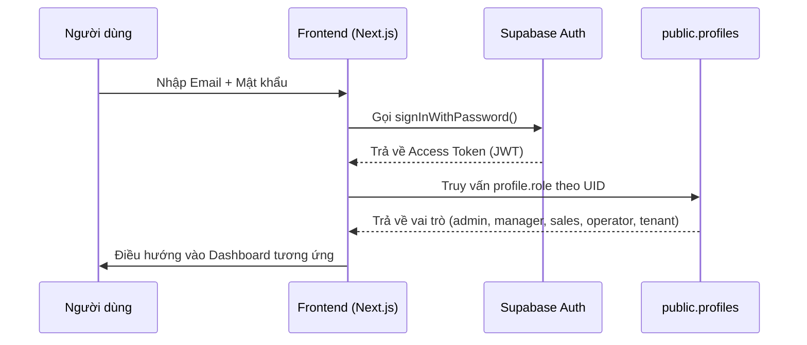

# Hướng dẫn Chức năng Đăng nhập & Đăng ký - Hệ thống Quản lý Trọ YoungHouse PMS

Chào bạn! Hệ thống quản lý trọ **YoungHouse PMS** đã được tích hợp sẵn hệ thống Đăng nhập / Đăng ký hoàn chỉnh liên kết trực tiếp với **Supabase Auth & Database**. 

Dưới đây là tài liệu hướng dẫn chi tiết cách thức hoạt động, danh sách các tài khoản Demo cho từng Vai trò (Roles), kèm theo **Kịch bản SQL tự động** để khởi tạo nhanh toàn bộ các tài khoản này trên cơ sở dữ liệu của bạn.

---

## 1. Cấu trúc & Cách thức Hoạt động của Chức năng Auth

Hệ thống sử dụng **Supabase Auth** để quản lý phiên đăng nhập bảo mật và bảng **`public.profiles`** để phân quyền chi tiết (RBAC).



- **Màn hình Đăng nhập:** [src/app/login/page.tsx](file:///e:/YoungHouse%202.0/HoaLacHomeSuper/src/app/login/page.tsx)
- **Màn hình Đăng ký:** [src/app/signup/page.tsx](file:///e:/YoungHouse%202.0/HoaLacHomeSuper/src/app/signup/page.tsx)
- **Thư viện gọi API Supabase:** [src/lib/supabaseServices.ts](file:///e:/YoungHouse%202.0/HoaLacHomeSuper/src/lib/supabaseServices.ts)
- **Trình tự động hóa database:** Khi một người dùng đăng ký mới, trigger `on_auth_user_created` trên Postgres sẽ tự động tạo một profile tương ứng trong bảng `public.profiles` với vai trò mặc định ban đầu là `user`.

---

## 2. Danh sách các Tài khoản Demo & Mật khẩu các Role

Để hỗ trợ bạn kiểm thử toàn diện tất cả các phân hệ và giao diện (RLS) của hệ thống, đây là danh sách các tài khoản demo chuẩn với vai trò tương ứng:

| STT | Vai trò (Role) | Email đăng nhập | Mật khẩu mặc định | Mô tả quyền hạn |
| :--- | :--- | :--- | :--- | :--- |
| **1** | **Admin** (Quản trị viên) | `admin@younghouse.vn` | `AdminPassword123` | Toàn quyền kiểm soát cấu hình hệ thống, duyệt thành viên, xem logs hệ thống. |
| **2** | **Manager** (Giám đốc / Chị Nhường) | `nhuong.manager@younghouse.vn` | `ManagerPassword123` | **Master role** — truy cập toàn bộ portal (Admin, Manager, Operator, Staff, Sales, Tenant), quản lý người dùng, giám sát vận hành và duyệt hoa hồng CTV. |
| **3** | **Sales** (Nhân viên / CTV) | `sales@younghouse.vn` | `SalesPassword123` | Tìm kiếm phòng trọ, hold phòng trống nội bộ cho khách thuê, đăng ký hoa hồng giới thiệu. |
| **4** | **Operator** (Kỹ thuật / Vận hành) | `operator@younghouse.vn` | `OperatorPassword123` | Ghi nhận chỉ số điện nước hàng tháng, xử lý phiếu báo hỏng/bảo trì của phòng trọ. |
| **5** | **Tenant** (Khách thuê trọ) | `tenant@younghouse.vn` | `TenantPassword123` | Tra cứu hợp đồng cá nhân, xem hóa đơn hàng tháng, gửi phiếu yêu cầu sửa chữa hỏng hóc. |
| **6** | **User** (Khách vãng lai) | `user@younghouse.vn` | `UserPassword123` | Xem danh sách phòng trống công khai, gửi lịch hẹn xem phòng. |

---

## 3. Kịch bản SQL Khởi tạo tự động các Tài khoản (Seed SQL)

> [!IMPORTANT]
> Việc chèn tài khoản vào Supabase Auth yêu cầu mã hóa mật khẩu theo chuẩn **bcrypt**. Bạn **không thể** chèn mật khẩu dạng văn bản thô (raw text) vào bảng `auth.users`.
>
> Hãy copy toàn bộ kịch bản SQL dưới đây và chạy trực tiếp trong **Supabase Dashboard > SQL Editor** để khởi tạo an toàn cả 6 tài khoản trên cùng lúc.

```sql
-- =========================================================================
-- KỊCH BẢN KHỞI TẠO TÀI KHOẢN VÀ VAI TRÒ DEMO (SEEDED USERS FOR YOUNGHOUSE PMS)
-- =========================================================================

-- Kích hoạt extension pgcrypto để thực hiện mã hóa bcrypt
CREATE EXTENSION IF NOT EXISTS "pgcrypto";

-- Tạo hàm tạm thời để sinh tài khoản an toàn
CREATE OR REPLACE FUNCTION pg_temp.create_demo_user(
  user_id uuid,
  user_email text,
  user_password text,
  user_name text,
  user_phone text,
  user_role text
) RETURNS void AS $$
DECLARE
  encrypted_pw text;
BEGIN
  -- Mã hóa mật khẩu với salt bcrypt
  encrypted_pw := crypt(user_password, gen_salt('bf', 10));

  -- 1. Chèn thông tin vào auth.users (Supabase Auth)
  INSERT INTO auth.users (
    id,
    instance_id,
    email,
    encrypted_password,
    email_confirmed_at,
    raw_app_meta_data,
    raw_user_meta_data,
    created_at,
    updated_at,
    role,
    aud,
    phone,
    confirmation_token,
    email_change,
    email_change_token_new,
    recovery_token
  ) VALUES (
    user_id,
    '00000000-0000-0000-0000-000000000000',
    user_email,
    encrypted_pw,
    now(),
    '{"provider": "email", "providers": ["email"]}'::jsonb,
    jsonb_build_object('name', user_name),
    now(),
    now(),
    'authenticated',
    'authenticated',
    user_phone,
    '',
    '',
    '',
    ''
  ) ON CONFLICT (id) DO NOTHING;

  -- 2. Cập nhật chính xác vai trò và thông tin cá nhân trong public.profiles
  -- (Trigger on_auth_user_created mặc định gắn role = 'user' ban đầu)
  UPDATE public.profiles
  SET role = user_role,
      name = user_name,
      phone = user_phone
  WHERE id = user_id;

END;
$$ LANGUAGE plpgsql SECURITY DEFINER;

-- Thực hiện chạy chèn dữ liệu
SELECT pg_temp.create_demo_user(
  'a1a1a1a1-a1a1-a1a1-a1a1-a1a1a1a1a1a1',
  'admin@younghouse.vn',
  'AdminPassword123',
  'YoungHouse Admin',
  '0911111111',
  'admin'
);

SELECT pg_temp.create_demo_user(
  'b2b2b2b2-b2b2-b2b2-b2b2-b2b2b2b2b2b2',
  'nhuong.manager@younghouse.vn',
  'ManagerPassword123',
  'Chị Nhường Manager',
  '0922222222',
  'manager'
);

SELECT pg_temp.create_demo_user(
  'c3c3c3c3-c3c3-c3c3-c3c3-c3c3c3c3c3c3',
  'sales@younghouse.vn',
  'SalesPassword123',
  'CTV Kinh Doanh',
  '0933333333',
  'sales'
);

SELECT pg_temp.create_demo_user(
  'd4d4d4d4-d4d4-d4d4-d4d4-d4d4d4d4d4d4',
  'operator@younghouse.vn',
  'OperatorPassword123',
  'Kỹ Thuật Viên',
  '0944444444',
  'operator'
);

SELECT pg_temp.create_demo_user(
  'e5e5e5e5-e5e5-e5e5-e5e5-e5e5e5e5e5e5',
  'tenant@younghouse.vn',
  'TenantPassword123',
  'Khách Thuê Trọ',
  '0955555555',
  'tenant'
);

SELECT pg_temp.create_demo_user(
  'f6f6f6f6-f6f6-f6f6-f6f6-f6f6f6f6f6f6',
  'user@younghouse.vn',
  'UserPassword123',
  'Khách Vãng Lai',
  '0966666666',
  'user'
);

-- Dọn dẹp hàm tạm sau khi hoàn tất
DROP FUNCTION IF EXISTS pg_temp.create_demo_user(uuid, text, text, text, text, text);
```

---

## 4. Hướng dẫn Từng bước thực hiện trên giao diện Supabase

1. Truy cập vào **[Supabase Console](https://supabase.com/dashboard/)** và chọn dự án của bạn.
2. Tại thanh điều hướng bên trái, bấm vào **SQL Editor**.
3. Bấm **New query** (Truy vấn mới).
4. Dán toàn bộ kịch bản SQL ở phần **3** vào khung soạn thảo.
5. Bấm **Run** (hoặc nhấn `Ctrl + Enter`).
6. Sau khi chạy xong, bạn có thể kiểm tra danh sách tài khoản tại phân hệ **Authentication > Users** trên thanh điều hướng hoặc truy vấn bảng `profiles` tại phần **Table Editor**.

---

## 5. Phân luồng sau Đăng nhập trên giao diện Next.js

Màn hình đăng nhập đã được thiết kế sẵn logic tự động phân luồng điều hướng dựa trên Role của tài khoản:
```typescript
if (user) {
  login(user);
  setSuccess('Đăng nhập thành công! Đang chuyển hướng...');
  setTimeout(() => {
    if (user.role === 'owner' || user.role === 'manager') {
      router.push('/owner'); // Điều hướng tới dashboard Quản lý/Chủ nhà
    } else if (user.role === 'admin') {
      router.push('/admin'); // Điều hướng tới trang Quản trị viên
    } else {
      router.push('/'); // Khách thuê, CTV và khách vãng lai về trang chủ
    }
  }, 1500);
}
```

---

## 6. Thông báo đẩy lên điện thoại (Web Push)

Hệ thống hỗ trợ **2 loại thông báo**:

| Loại | Khi nào thấy | Cách bật |
| :--- | :--- | :--- |
| **Trong app** | Chỉ khi đang mở website | Icon chuông 🔔 trên header |
| **Push điện thoại** | Hiện trên màn hình khóa / thanh thông báo | Bật trong **Cài đặt tenant** hoặc **Tài khoản** |

### Cấu hình server (chạy 1 lần)

**Bước 1 — Tạo VAPID keys:**
```bash
npx web-push generate-vapid-keys
```

**Bước 2 — Thêm vào `.env.local`:**
```env
NEXT_PUBLIC_VAPID_PUBLIC_KEY=<publicKey>
VAPID_PRIVATE_KEY=<privateKey>
VAPID_SUBJECT=mailto:admin@younghouse.vn
```

**Bước 3 — Chạy SQL trên Supabase:** file `database/push_subscriptions.sql`

**Bước 4 — Deploy với HTTPS** (bắt buộc cho push; localhost OK khi dev)

### Người dùng bật trên điện thoại

1. Đăng nhập → **Tenant → Cài đặt** (hoặc `/account`)
2. Nhấn **Bật thông báo đẩy** → Cho phép trình duyệt
3. **iPhone (Safari):** Thêm site vào Màn hình chính trước, rồi mở app và bật thông báo
4. **Android (Chrome):** Mở site → bật thông báo trực tiếp

Khi Admin tạo thông báo mới (đang bật), hệ thống tự gửi push tới các thiết bị đã đăng ký thuộc đúng nhóm đối tượng.

---

Chúc bạn trải nghiệm và vận hành hệ thống YoungHouse PMS thuận lợi! Nếu bạn gặp bất kỳ vướng mắc gì về phân quyền hay kết nối Database, đừng ngần ngại nhắn tôi nhé!
